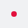
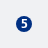
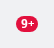
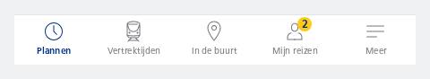
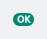

#### Important



```kotlin
NesBadge(
    contentDescription = "Notification",
    variant = NesBadgeVariant.Important
)
```

#### With number



```kotlin
NesBadge(
    contentDescription = "There are 5 unread messages",
    variant = NesBadgeVariant.Default,
    count = 5
)
```

#### With number exceeding max

This will display as "9+"



```kotlin
NesBadge(
    contentDescription = "There are 16 disturbances",
    variant = NesBadgeVariant.Important,
    count = 16
)
```

#### Bottom Navigation with 5 items

Shows a badge on the "Mijn reizen" tab



```kotlin
data class NavItem(
    val label: String,
    @param:DrawableRes val icon: Int,
    val selected: Boolean = false,
    val count: Int? = null
)

val items = listOf(
    NavItem(label = "Plannen", icon = R.drawable.ic_nes_32x32_clock, selected = true),
    NavItem(label = "Vertrektijden", icon = R.drawable.ic_nes_32x32_train),
    NavItem(label = "In de buurt", icon = R.drawable.ic_nes_32x32_marker),
    NavItem(label = "Mijn reizen", icon = R.drawable.ic_nes_32x32_user, count = 2),
    NavItem(label = "Meer", icon = R.drawable.ic_nes_32x32_menu)
)

NesBottomNavigation {
    items.forEach { item ->
        NesBottomNavigationItem(
            selected = item.selected,
            icon = { NesIcon(icon = item.icon, contentDescription = null) },
            label = { NesText(text = item.label) },
            // Ensure that the legacy style of handling badge semantics is disabled
            // Currently the default is set to `true` because of the Plugin Architecture
            useLegacySemanticsForBadge = false,
            badge = if (item.count != null) {
                @Composable {
                    // When adding a badge to the Bottom Navigation, set its contentDescription
                    // to null and include the badge within the NesBottomNavigationItem's modifier.
                    // This ensures TalkBack reads the badge and the navigation item together as
                    // a single accessibility element, rather than as separate selectable items.
                    NesBadge(
                        count = item.count,
                        contentDescription = null,
                        variant = NesBadgeVariant.Brand,
                    )
                }
            } else {
                // Ensure `badge` is set to null when not needed;
                // otherwise, it can override and remove the semantics for the label and icon.
                null
            },
            modifier = if (item.count != null) {
                // Manually set semantics when this Navigation Item contains a badge.
                // Remember to include the title and any other relevant information in the
                // updated description.
                Modifier.semantics {
                    contentDescription = "${item.label}, There are ${item.count} new items"
                }
            } else Modifier,
            onClick = {}
        )
    }
}
```

#### Display text



```kotlin
NesBadge(
    contentDescription = "Successful operation",
    variant = NesBadgeVariant.Success,
    text = "OK"
)
```

