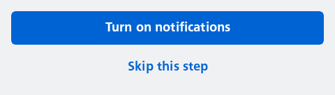

#### Vertical stacking of buttons



```kotlin
NesButtonGroup(
    stack = NesButtonGroupStack.Vertical,
    primaryAction = {
        NesButton(
            text = "Turn on notifications",
            onClick = { println("Notifications button pressed") }
        )
    },
    otherActions = {
        NesButton(
            text = "Skip this step",
            onClick = { println("Skip button pressed") }
        )
    }
)
```

#### Horizontal stacking of buttons


```kotlin
NesButtonGroup(
    stack = NesButtonGroupStack.Horizontal,
    primaryAction = {
        NesButton(
            text = "This is correct!",
            onClick = { println("'This is correct!' button pressed") }
        )
    },
    otherActions = {
        NesButton(
            text = "Change address",
            onClick = { println("'Change address' button pressed") }
        )
    }
)
```

#### Branded primary button in horizontal stacking


```kotlin
NesButtonGroup(
    stack = NesButtonGroupStack.Horizontal,
    primaryActionType = NesButtonType.Brand,
    primaryAction = {
        NesButton(
            text = "Save",
            onClick = { println("Save button pressed") }
        )
    },
    otherActions = {
        NesButton(
            text = "Cancel",
            onClick = { println("Cancel button pressed") }
        )
    }
)
```

