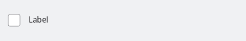
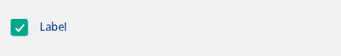
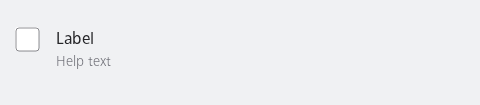
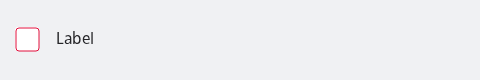
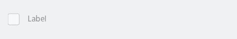
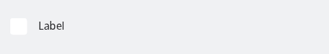
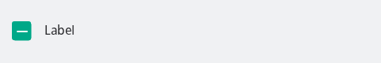

#### Unchecked checkbox



```kotlin
var checked by remember { mutableStateOf(false) }
NesCheckbox(
    text = "Label",
    checked = checked,
    onCheckedChange = { checked = it }
)
```

#### Checked checkbox



```kotlin
var checked by remember { mutableStateOf(true) }
NesCheckbox(
    text = "Label",
    checked = checked,
    onCheckedChange = { checked = it }
)
```

#### Checkbox with help text shown underneath the label



```kotlin
var checked by remember { mutableStateOf(false) }
NesCheckbox(
    text = "Label",
    helpText = "Help text",
    checked = checked,
    onCheckedChange = { checked = it }
)
```

#### Checkbox in an error state



```kotlin
var checked by remember { mutableStateOf(false) }
NesCheckbox(
    text = "Label",
    checked = checked,
    error = true,
    onCheckedChange = { checked = it }
)
```

#### Disabled checkbox



```kotlin
var checked by remember { mutableStateOf(false) }
NesCheckbox(
    text = "Label",
    checked = checked,
    enabled = false,
    onCheckedChange = { checked = it }
)
```

#### Checkbox with the border hidden



```kotlin
var checked by remember { mutableStateOf(false) }
NesCheckbox(
    text = "Label",
    checked = checked,
    border = false,
    onCheckedChange = { checked = it }
)
```

#### Tri-state checkbox in an indeterminate state, used for parent checkboxes that

represent a partially checked group of child checkboxes



```kotlin
NesTriStateCheckbox(
    text = "Label",
    state = ToggleableState.Indeterminate,
    onClick = {}
)
```

