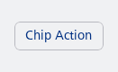
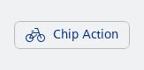
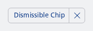
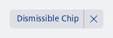
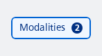
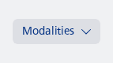

#### Action Chip with only a label



```kotlin
NesChipAction(
    text = "Chip Action",
    onClick = { /* Handle click */ }
)
```

#### Action Chip with both an icon and label



```kotlin
NesChipAction(
    text = "Chip Action",
    leadingIcon = R.drawable.ic_nes_cropped_bike,
    onClick = { /* Handle click */ }
)
```

#### Dismissible Chip with a label and dismiss action

This sample demonstrates how to create a dismissible chip that includes a label and a dismiss button, which can be used to remove the chip from the UI.



```kotlin
NesChipDismissible(
    text = "Dismissible Chip",
    onDismissClick = { /* Handle dismiss */ },
)
```

#### Dismissible Chip with a filled style, label, and dismiss action



```kotlin
NesChipDismissible(
    text = "Dismissible Chip",
    filled = true,
    onDismissClick = { /* Handle dismiss */ },
)
```

#### Checked Filter Chip with a label and a badge

This sample demonstrates how to create a filter chip that is checked, includes a label, and displays a badge with a count. The badge can be used to indicate the number of items filtered by this chip.



```kotlin
var checked by remember { mutableStateOf(true) }
NesChipFilter(
    text = "Modalities",
    checked = checked,
    onCheckedChange = { newState ->
        checked = newState
    },
    badge = {
        NesBadge(
            count = 2,
            contentDescription = "2 filtered modalities",
        )
    }
)
```

#### Filled Filter Chip with a label and the multi option

This sample demonstrates how to create a filter chip that is filled, includes a label, and allows for multiple selections.



```kotlin
var checked by remember { mutableStateOf(false) }
NesChipFilter(
    text = "Modalities",
    filled = true,
    multi = true,
    checked = checked,
    onCheckedChange = { newState ->
        checked = newState
    },
)
```

