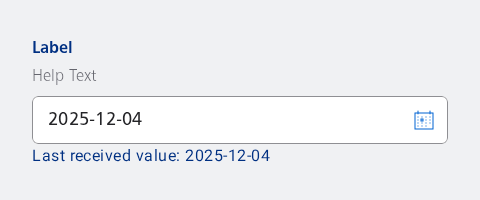

#### Date input

Either input the date in the input field or use the dialog by clicking the action button.


```kotlin
val dateInputPlaceholder = stringResource(id = R.string.nes_dateinput_placeholder)
val date = LocalDate.now()

var value by remember { mutableStateOf(LocalDate.of(date.year, date.month, date.dayOfMonth)) }
var openDialog by remember { mutableStateOf(false) }

if (openDialog) {
    NesDatePicker(
        onDateSelected = { value = it },
        onDismissRequest = {
            openDialog = false
        },
        currentDate = value,
        buttonCancelTestTag = "date-picker",
        buttonConfirmTestTag = "date-picker"
    )
}

NesFormRow(
    label = "Label",
    helpText = "Help Text",
    optional = false,
    modifier = Modifier.padding(NesTheme.dimens.spacing_4),
    testTag = "input-example-row"
) {
    NesDatePickerInput(
        value = value,
        onValueChange = { value = it },
        placeholder = dateInputPlaceholder,
        onActionClick = { openDialog = true }
    )
    NesText(
        text = "Last received value: $value"
    )
}
```

#### Date picker

Always use the dialog to select the date.



```kotlin
val dateInputPlaceholder = stringResource(id = R.string.nes_dateinput_placeholder)
val date = LocalDate.now()

var value by remember { mutableStateOf(LocalDate.of(date.year, date.month, date.dayOfMonth)) }
var openDialog by remember { mutableStateOf(false) }

if (openDialog) {
    NesDatePicker(
        onDateSelected = { value = it },
        onDismissRequest = {
            openDialog = false
        },
        currentDate = value,
        buttonCancelTestTag = "date-picker",
        buttonConfirmTestTag = "date-picker"
    )
}

NesFormRow(
    label = "Label",
    helpText = "Help Text",
    optional = false,
    modifier = Modifier.padding(NesTheme.dimens.spacing_4),
    testTag = "input-example-row"
) {
    NesDatePickerInput(
        value = value,
        pickerOnly = true,
        onValueChange = { value = it },
        placeholder = dateInputPlaceholder,
        onActionClick = { openDialog = true }
    )
    NesText(
        text = "Last received value: $value"
    )
}
```

