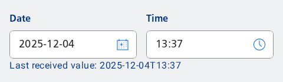
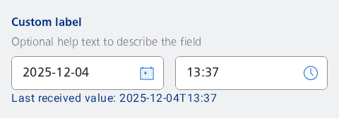

#### Date and Time input

Either input the date and time in the input field or use the dialogs by clicking one of the action buttons.


```kotlin
val timeInputPlaceholder = stringResource(id = R.string.nes_timeinput_placeholder)
val dateInputPlaceholder = stringResource(id = R.string.nes_dateinput_placeholder)
val dateTime = LocalDateTime.now()

var value by remember { mutableStateOf(LocalDateTime.of(dateTime.toLocalDate(), dateTime.toLocalTime())) }
var openDateDialog by remember { mutableStateOf(false) }
var openTimeDialog by remember { mutableStateOf(false) }

if (openDateDialog) {
    NesDatePicker(
        onDateSelected = {
            value = LocalDateTime.of(it, value.toLocalTime())
        },
        onDismissRequest = {
            openDateDialog = false
        },
        currentDate = value.toLocalDate(),
        buttonCancelTestTag = "date-picker",
        buttonConfirmTestTag = "date-picker"
    )
} else if (openTimeDialog) {
    NesTimePicker(
        onTimeSelected = {
            value = LocalDateTime.of(value.toLocalDate(), it)
        },
        onDismissRequest = {
            openTimeDialog = false
        },
        currentTime = value.toLocalTime(),
        buttonCancelTestTag = "time-picker",
        buttonConfirmTestTag = "time-picker"
    )
}

Column {
    NesDateTimePickerInput(
        value = value,
        onValueChange = { value = it },
        placeholderDate = dateInputPlaceholder,
        placeholderTime = timeInputPlaceholder,
        onDatePickerClick = { openDateDialog = true },
        onTimePickerClick = { openTimeDialog = true },
    )
    NesText(
        text = "Last received value: $value"
    )
}
```

#### Date and Time picker

Always use the dialog to select the date and/or time.



```kotlin
val timeInputPlaceholder = stringResource(id = R.string.nes_timeinput_placeholder)
val dateInputPlaceholder = stringResource(id = R.string.nes_dateinput_placeholder)
val dateTime = LocalDateTime.now()

var value by remember {
    mutableStateOf(
        LocalDateTime.of(
            dateTime.toLocalDate(),
            dateTime.toLocalTime()
        )
    )
}
var openDateDialog by remember { mutableStateOf(false) }
var openTimeDialog by remember { mutableStateOf(false) }

if (openDateDialog) {
    NesDatePicker(
        onDateSelected = {
            value = LocalDateTime.of(it, value.toLocalTime())
        },
        onDismissRequest = {
            openDateDialog = false
        },
        currentDate = value.toLocalDate(),
        buttonCancelTestTag = "date-picker",
        buttonConfirmTestTag = "date-picker"
    )
} else if (openTimeDialog) {
    NesTimePicker(
        onTimeSelected = {
            value = LocalDateTime.of(value.toLocalDate(), it)
        },
        onDismissRequest = {
            openTimeDialog = false
        },
        currentTime = value.toLocalTime(),
        buttonCancelTestTag = "time-picker",
        buttonConfirmTestTag = "time-picker"
    )
}

Column {
    NesDateTimePickerInput(
        value = value,
        pickerOnly = true,
        onValueChange = { value = it },
        placeholderDate = dateInputPlaceholder,
        placeholderTime = timeInputPlaceholder,
        onDatePickerClick = { openDateDialog = true },
        onTimePickerClick = { openTimeDialog = true },
    )
    NesText(
        text = "Last received value: $value"
    )
}
```

#### Date and Time picker with custom label and help text

Show a custom label and help text instead of the default "Date" and "Time" labels. You can only have one label above the grouped components if you choose this method.



```kotlin
val timeInputPlaceholder = stringResource(id = R.string.nes_timeinput_placeholder)
val dateInputPlaceholder = stringResource(id = R.string.nes_dateinput_placeholder)
val dateTime = LocalDateTime.now()

var value by remember { mutableStateOf(LocalDateTime.of(dateTime.toLocalDate(), dateTime.toLocalTime())) }
var openDateDialog by remember { mutableStateOf(false) }
var openTimeDialog by remember { mutableStateOf(false) }

if (openDateDialog) {
    NesDatePicker(
        onDateSelected = {
            value = LocalDateTime.of(it, value.toLocalTime())
        },
        onDismissRequest = {
            openDateDialog = false
        },
        currentDate = value.toLocalDate(),
        buttonCancelTestTag = "date-picker",
        buttonConfirmTestTag = "date-picker"
    )
} else if (openTimeDialog) {
    NesTimePicker(
        onTimeSelected = {
            value = LocalDateTime.of(value.toLocalDate(), it)
        },
        onDismissRequest = {
            openTimeDialog = false
        },
        currentTime = value.toLocalTime(),
        buttonCancelTestTag = "time-picker",
        buttonConfirmTestTag = "time-picker"
    )
}

Column {
    NesDateTimePickerInput(
        label = "Custom label",
        helpText = "Optional help text to describe the field",
        value = value,
        pickerOnly = true,
        onValueChange = { value = it },
        placeholderDate = dateInputPlaceholder,
        placeholderTime = timeInputPlaceholder,
        onDatePickerClick = { openDateDialog = true },
        onTimePickerClick = { openTimeDialog = true },
    )
    NesText(
        text = "Last received value: $value"
    )
}
```

