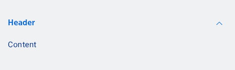
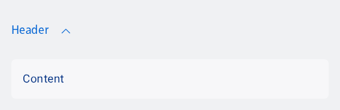
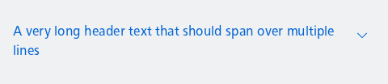

#### List, expanded



```kotlin
var expanded by rememberSaveable { mutableStateOf(NesExpandableState.Expanded) }
NesExpandable(
    header = "Header",
    type = NesExpandableType.List,
    expanded = expanded,
    onExpand = { expanded = NesExpandableState.Expanded },
    onCollapse = { expanded = NesExpandableState.Collapsed }
) {
    NesText("Content")
}
```

#### Stand-alone, expanded with tinted content



```kotlin
var expanded by rememberSaveable { mutableStateOf(NesExpandableState.Expanded) }
NesExpandable(
    header = "Header",
    type = NesExpandableType.StandAlone,
    contentTint = true,
    expanded = expanded,
    onExpand = { expanded = NesExpandableState.Expanded },
    onCollapse = { expanded = NesExpandableState.Collapsed }
) {
    NesText("Content")
}
```

#### Stand-alone, collapsed with a long, multiline header



```kotlin
var expanded by rememberSaveable { mutableStateOf(NesExpandableState.Collapsed) }
NesExpandable(
    header = "A very long header text that should span over multiple lines",
    type = NesExpandableType.StandAlone,
    contentTint = true,
    expanded = expanded,
    onExpand = { expanded = NesExpandableState.Expanded },
    onCollapse = { expanded = NesExpandableState.Collapsed }
) {
    NesText("Content")
}
```

