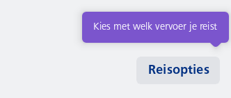
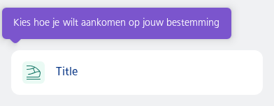

#### Attach to end



```kotlin
val state = rememberFeatureTipState(initialKey = "reisopties")
/*
 * NesFeatureTip controls handling when a Feature Tip was clicked on. For example; you can call
 * analytics functions here. Also updates the state to show the next Feature Tip if any.
 */
NesFeatureTip(
    state = state,
    onClick = {
        state.next()
    },
    onDismiss = {
        state.dismiss()
    }
)
// Box is merely here for layout purposes.
Box(
    modifier = Modifier.size(width = 300.dp, height = 110.dp),
    contentAlignment = Alignment.BottomEnd
) {
    NesButton(
        text = "Reisopties",
        type = NesButtonType.Secondary,
        size = NesButtonSize.Compact,
        wrap = true,
        onClick = { println("Reisopties clicked") },
        /*
         * The featureTipAnchor() modifier acts as the anchor for the Feature Tip to know to
         * which Composable it should point.
         */
        modifier = Modifier.featureTipAnchor(
            key = "reisopties",
            state = state,
            position = NesFeatureTipPosition.TopLeft,
            label = "Kies met welk vervoer je reist"
        )
    )
}
```

#### Attach to start



```kotlin
val state = rememberFeatureTipState(initialKey = "list-item")
NesFeatureTip(
    state = state,
    onClick = {
        state.next()
    },
    onDismiss = {
        state.dismiss()
    }
)
// Box is merely here for layout purposes.
Box(
    modifier = Modifier.size(width = 360.dp, height = 120.dp),
    contentAlignment = Alignment.BottomStart
) {
    NesListItemDataAction(
        type = NesListItemType.Single,
        icon = R.drawable.ic_nes_cropped_train_ic_alt,
        iconVariant = ListItemChildIconColorVariant.Green,
        label = "Title",
        modifier = Modifier.featureTipAnchor(
            "list-item",
            state = state,
            position = NesFeatureTipPosition.TopRight,
            label = "Kies hoe je wilt aankomen op jouw bestemming"
        ),
        onClick = { /* Handle action click */ }
    )
}
```

