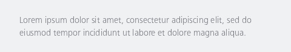
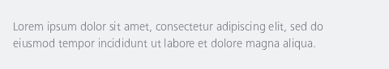
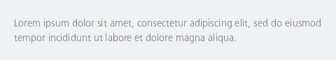

#### Default indents



```kotlin
NesHelpText(text = "Lorem ipsum dolor sit amet, consectetur adipiscing elit, sed do eiusmod tempor incididunt ut labore et dolore magna aliqua.")
```

#### No starting indent



```kotlin
NesHelpText(
    text = "Lorem ipsum dolor sit amet, consectetur adipiscing elit, sed do eiusmod tempor incididunt ut labore et dolore magna aliqua.",
    indent = NesHelpTextIndent.None
)
```

#### Custom Indent



```kotlin
NesHelpText(
    text = "Lorem ipsum dolor sit amet, consectetur adipiscing elit, sed do eiusmod tempor incididunt ut labore et dolore magna aliqua.",
    indent = NesHelpTextIndent.Custom(paddingValues = PaddingValues(
        start = 4.dp,
        end = 4.dp,
        top = 8.dp,
        bottom = 4.dp
    ))
)
```

