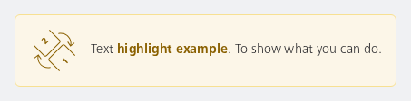
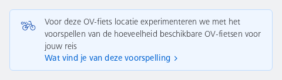

#### Highlight a text

Shows how to easily highlight a part of the text, in this case "highlight example" will be highlighted.



```kotlin
NesHighlightBox(
    icon = R.drawable.ic_nes_detail_switch_class,
    text = attachHighlight(
        source = "Text highlight example. To show what you can do.",
        "highlight example"
    ),
    type = NesHighlightBoxType.Brand
)
```

#### Info with bike icon and long text and a link

The icon will be placed at the top of the box instead of being centered because of the height.



```kotlin
NesHighlightBox(
    icon = R.drawable.ic_nes_32x32_ov_fiets,
    text = "Voor deze OV-fiets locatie experimenteren we met het voorspellen van de hoeveelheid beschikbare OV-fietsen voor jouw reis",
    linkText = "Wat vind je van deze voorspelling",
    type = NesHighlightBoxType.Info,
    onLinkClick = { /* Handle click */ }
)
```

