#### Train (Intercity)

This sample demonstrates how to create a public transport journey pill with a Intercity train type and a label "IC Direct".

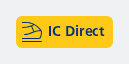

```kotlin
NesJourneyPillPublicTransport(
    transport = NesJourneyPillType.PublicTransport.Train(NesJourneyModalityTrainSubtype.Intercity),
    label = "IC Direct"
)
```

#### Cancelled Train (Intercity)

This sample demonstrates how to create a public transport journey pill with a cancelled train of type Intercity, a critical attention badge and a label "Maastricht". Contains the optional filled content description text for accessibility; this will override everything provided by default and currently would be read by screen readers as: "De trein naar Maastricht rijdt niet vanwege een gestrande trein"

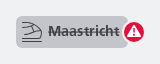

```kotlin
NesJourneyPillPublicTransport(
    transport = NesJourneyPillType.PublicTransport.Train(NesJourneyModalityTrainSubtype.Intercity),
    cancelled = true,
    attentionBadge = NesAttentionBadgeType.Critical,
    contentDescription = "De trein naar Maastricht rijdt niet vanwege een gestrande trein",
    label = "Maastricht"
)
```

#### Bus (Cancelled)

This sample demonstrates how to create a public transport journey pill with a bus type, a label "M5" and a cancelled state. The attention badge is set to critical.

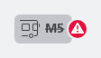

```kotlin
NesJourneyPillPublicTransport(
    transport = NesJourneyPillType.PublicTransport.OV(NesJourneyModalityOVSubtype.Bus),
    label = "M5",
    cancelled = true,
    attentionBadge = NesAttentionBadgeType.Critical
)
```

#### Journey Pills with same height in a Row

Example on how to use the Journey Pills with intrinsic heights to make sure all of them are displayed in a same size.

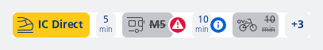

```kotlin
Row(
    modifier = Modifier
        .background(NesTokens.colors.contentBackgroundDefault)
        .height(IntrinsicSize.Max),
    horizontalArrangement = Arrangement.spacedBy(8.dp)
) {
    NesJourneyPillPublicTransport(
        transport = NesJourneyPillType.PublicTransport.Train(NesJourneyModalityTrainSubtype.Intercity),
        label = "IC Direct",
        pillModifier = Modifier.fillMaxHeight()
    )

    NesJourneyPillTransfer(
        time = 5,
        pillModifier = Modifier.fillMaxHeight(),
    )

    NesJourneyPillPublicTransport(
        transport = NesJourneyPillType.PublicTransport.OV(NesJourneyModalityOVSubtype.Bus),
        label = "M5",
        cancelled = true,
        attentionBadge = NesAttentionBadgeType.Critical,
        pillModifier = Modifier.fillMaxHeight()
    )

    NesJourneyPillTransfer(
        time = 10,
        attentionBadge = NesAttentionBadgeType.Info,
        pillModifier = Modifier.fillMaxHeight(),
    )

    NesJourneyPillModality(
        modality = NesJourneyPillType.Modality.Shared(NesJourneyModalitySharedSubtype.OVFiets),
        time = 10,
        cancelled = true,
        pillModifier = Modifier.fillMaxHeight(),
    )

    NesJourneyPillExpand(
        count = 3,
        onClick = { println("Expand clicked!") },
        pillModifier = Modifier.fillMaxHeight()
    )
}
```

#### Train (Sprinter)

This sample demonstrates how to create a public transport journey pill with a Sprinter train type without a label, but with a click action.


```kotlin
NesJourneyPillPublicTransport(
    transport = NesJourneyPillType.PublicTransport.Train(NesJourneyModalityTrainSubtype.Sprinter),
    onClick = { println("Sprinter journey clicked!") }
)
```

#### Own: Bike

This sample demonstrates how to create a modality journey pill with a bike type.

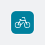

```kotlin
NesJourneyPillModality(
    modality = NesJourneyPillType.Modality.Own(NesJourneyModalityOwnSubtype.Bike)
)
```

#### Shared: Check

This sample demonstrates how to create a modality journey pill with a shared Check-scooter type, and shows a duration of 15 minutes.

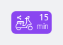

```kotlin
NesJourneyPillModality(
    modality = NesJourneyPillType.Modality.Shared(NesJourneyModalitySharedSubtype.Check),
    time = 15
)
```

#### Shared: Car

This sample demonstrates how to create a modality journey pill with a custom content description. This will override everything.

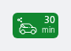

```kotlin
NesJourneyPillModality(
    modality = NesJourneyPillType.Modality.Shared(NesJourneyModalitySharedSubtype.Car),
    contentDescription = "Go by Shared Car modality, drive for 30 minutes.",
    time = 30
)
```

#### Shared: OV-Fiets

This sample demonstrates how to create a cancelled modality journey pill with an OV-Fiets type, and shows a duration of 10 minutes.

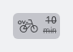

```kotlin
NesJourneyPillModality(
    modality = NesJourneyPillType.Modality.Shared(NesJourneyModalitySharedSubtype.OVFiets),
    time = 10,
    cancelled = true
)
```

#### Walk with Attention Badge

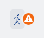

```kotlin
NesJourneyPillModality(
    modality = NesJourneyPillType.Modality.Other(NesJourneyModalityOtherSubtype.Walk),
    attentionBadge = NesAttentionBadgeType.Warning
)
```

#### Walk with Time and Attention Badge

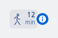

```kotlin
NesJourneyPillModality(
    modality = NesJourneyPillType.Modality.Other(NesJourneyModalityOtherSubtype.Walk),
    time = 12,
    attentionBadge = NesAttentionBadgeType.Info
)
```

#### Clickable Walk

This sample demonstrates how to create a clickable modality journey pill which shows a Walk with, a duration of 5 minutes.

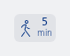

```kotlin
NesJourneyPillModality(
    modality = NesJourneyPillType.Modality.Other(NesJourneyModalityOtherSubtype.Walk),
    time = 5,
    onClick = { println("Walk journey clicked!") }
)
```

#### Transfer of 5 minutes

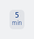

```kotlin
NesJourneyPillTransfer(time = 5)
```

#### Transfer of 5 minutes with an icon (suggesting a check-in/out)

Make sure to use the cropped icons from Nessie so that the bounding box doesn't expand.

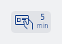

```kotlin
NesJourneyPillTransfer(
    icon = R.drawable.ic_nes_cropped_subscription,
    time = 5
)
```

#### Cancelled transfer with a warning attention badge and default accessibility labels

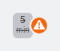

```kotlin
NesJourneyPillTransfer(
    time = 5,
    cancelled = true,
    attentionBadge = NesAttentionBadgeType.Warning
)
```

#### Cancelled transfer with a warning attention badge and overridden accessibility label

Description will read out as: "Overstap niet mogelijk"


```kotlin
NesJourneyPillTransfer(
    time = 5,
    cancelled = true,
    contentDescription = "Overstap niet mogelijk",
    attentionBadge = NesAttentionBadgeType.Warning
)
```

#### Clickable transfer with info badge

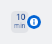

```kotlin
NesJourneyPillTransfer(
    time = 10,
    attentionBadge = NesAttentionBadgeType.Info,
    onClick = { println("Transfer journey clicked!") }
)
```

#### Expand pill with +4 legs available

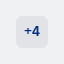

```kotlin
NesJourneyPillExpand(
    count = 4,
    onClick = { println("Expand clicked!") }
)
```

#### Cancelled expand pill with +5 legs available

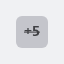

```kotlin
NesJourneyPillExpand(
    count = 5,
    cancelled = true,
    onClick = { println("Expand clicked!") }
)
```

