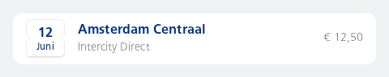
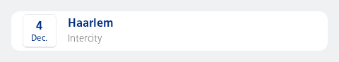

#### Custom NesListItem using the leading, content, and trailing scopes together.



```kotlin
NesListItem(
    type = NesListItemType.Single,
    leading = {
        Date(
            day = 12,
            month = "Juni",
            style = DateStyle.Ticket
        )
    },
    content = {
        Column {
            Label(
                text = "Amsterdam Centraal",
                style = NesTokens.typography.labelDefaultStrong
            )
            Subtext("Intercity Direct")
        }
    },
    trailing = {
        TrailingText(text = "€ 12,50")
    }
)
```

#### Custom NesListItem with a different size and padding values



```kotlin
NesListItem(
    type = NesListItemType.Single,
    size = NesListItemSize.Custom(
        customMinHeight = NesTokens.layout.sizeComponentControlHeightTiny,
        customPaddingValues = PaddingValues(
            vertical = NesTokens.layout.spaceXs
        )
    ),
    leading = {
        Date(
            day = 4,
            month = "Dec."
        )
    },
    content = {
        Column {
            Label(
                text = "Haarlem",
                style = NesTokens.typography.labelDefaultStrong
            )
            Subtext("Intercity")
        }
    }
)
```

#### List of three contained navigation items.


```kotlin
val numberOfItems = 3
LazyColumn {
    items((0 until numberOfItems).toList()) { index ->
        val type = NesListItemType.fromIndex(index = index, count = numberOfItems)
        NesListItemNavigation(
            type = type,
            icon = R.drawable.ic_nes_cropped_train_ic_alt,
            label = "Label",
            subtext = type.name,
            onClick = { /* No-op */ }
        )
    }
}
```

