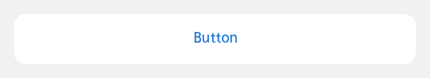
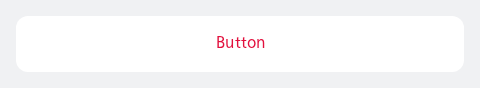

#### Single, contained



```kotlin
NesListItemButton(
    label = "Button",
    type = NesListItemType.Single,
    onClick = { println("Item clicked") }
)
```

#### Single, contained, destructive



```kotlin
NesListItemButton(
    label = "Button",
    isDestructive = true,
    type = NesListItemType.Single,
    onClick = { println("Item clicked") }
)
```

