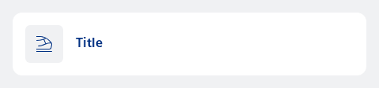
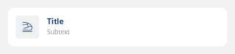
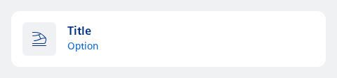

#### Single, contained, with label only



```kotlin
NesListItemContextAction(
    icon = R.drawable.ic_nes_cropped_train_ic_alt,
    label = "Title",
    type = NesListItemType.Single,
    onClick = { println("Action clicked") }
)
```

#### Single, contained, with subtext



```kotlin
NesListItemContextAction(
    icon = R.drawable.ic_nes_cropped_train_ic_alt,
    label = "Title",
    subtext = "Subtext",
    type = NesListItemType.Single,
    onClick = { println("Action clicked") }
)
```

#### Single, contained, with option



```kotlin
NesListItemContextAction(
    icon = R.drawable.ic_nes_cropped_train_ic_alt,
    label = "Title",
    subtext = "Option",
    hasOptions = true,
    type = NesListItemType.Single,
    onClick = { println("Action clicked") }
)
```

