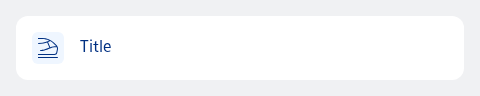
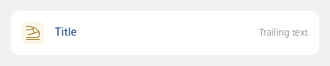
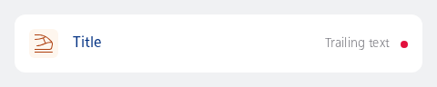
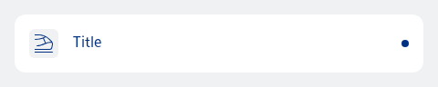

#### Single, contained, with label only



```kotlin
NesListItemDataAction(
    icon = R.drawable.ic_nes_cropped_train_ic_alt,
    iconVariant = ListItemChildIconColorVariant.Info,
    label = "Title",
    type = NesListItemType.Single,
    onClick = { println("Action clicked") }
)
```

#### Single, contained, with trailing text



```kotlin
NesListItemDataAction(
    icon = R.drawable.ic_nes_cropped_train_ic_alt,
    iconVariant = ListItemChildIconColorVariant.Brand,
    label = "Title",
    trailingText = "Trailing text",
    type = NesListItemType.Single,
    onClick = { println("Action clicked") }
)
```

#### Single, contained, with trailing text and importance badge



```kotlin
NesListItemDataAction(
    icon = R.drawable.ic_nes_cropped_train_ic_alt,
    iconVariant = ListItemChildIconColorVariant.Orange,
    label = "Title",
    trailingText = "Trailing text",
    badgeVariant = NesBadgeVariant.Important,
    type = NesListItemType.Single,
    onClick = { println("Action clicked") }
)
```

#### Single, contained, with trailing text and importance badge



```kotlin
NesListItemDataAction(
    icon = R.drawable.ic_nes_cropped_train_ic_alt,
    iconVariant = ListItemChildIconColorVariant.Gray,
    label = "Title",
    badgeVariant = NesBadgeVariant.Default,
    type = NesListItemType.Single,
    onClick = { println("Action clicked") }
)
```

