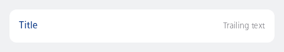
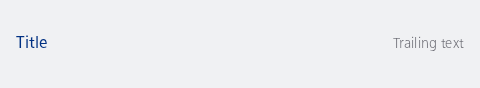

#### Single, contained, with trailing text

Showing a list item with only a label and trailing text.



```kotlin
NesListItemDescription(
    label = "Title",
    trailingText = "Trailing text",
    type = NesListItemType.Single,
    onClick = { println("Item clicked") }
)
```

#### Single, uncontained, non-clickable

Showing a list item with only a label as uncontained and non-clickable



```kotlin
NesListItemDescription(
    label = "Title",
    trailingText = "Trailing text",
    type = NesListItemType.Single
)
```

