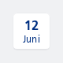
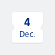

#### Leading scope date helper.



```kotlin
Date(
    day = 12,
    month = "Juni",
    style = DateStyle.Calendar
)
```

#### Leading scope ticket helper.



```kotlin
Date(
    day = 4,
    month = "Dec.",
    style = DateStyle.Ticket
)
```

