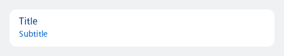
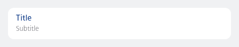

#### Single, contained, has option(s)

Text below the label will be displayed as option (interactive colour)



```kotlin
NesListItemMenu(
    label = "Title",
    subtext = "Subtitle",
    type = NesListItemType.Single,
    onClick = { println("Item clicked") }
)
```

#### Single, contained, as subtext

Text below the label will be rendered as subtext (help text colour)



```kotlin
NesListItemMenu(
    label = "Title",
    subtext = "Subtitle",
    hasOptions = false,
    type = NesListItemType.Single,
    onClick = { println("Item clicked") }
)
```

