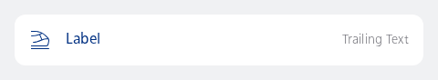
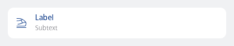
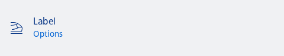
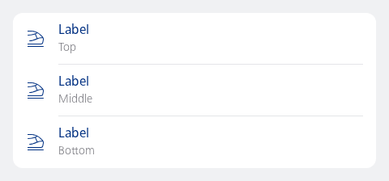

#### Single, contained, with trailing text

Showing a list item with a train icon, label and trailing text.



```kotlin
NesListItemNavigation(
    label = "Label",
    trailingText = "Trailing Text",
    type = NesListItemType.Single,
    icon = R.drawable.ic_nes_cropped_train_ic_alt,
    onClick = { println("Item clicked") }
)
```

#### Single, contained, with subtext

Showing a list item with a train icon, label and subtext



```kotlin
NesListItemNavigation(
    label = "Label",
    subtext = "Subtext",
    type = NesListItemType.Single,
    icon = R.drawable.ic_nes_cropped_train_ic_alt,
    onClick = { println("Item clicked") }
)
```

#### Single, uncontained, with options

Showing a list item with a train icon, label and subtext (as options).



```kotlin
NesListItemNavigation(
    label = "Label",
    subtext = "Options",
    hasOptions = true,
    contained = false,
    type = NesListItemType.Single,
    icon = R.drawable.ic_nes_cropped_train_ic_alt,
    onClick = { println("Item clicked") }
)
```

#### List of three contained navigation items.



```kotlin
val numberOfItems = 3
LazyColumn {
    items((0 until numberOfItems).toList()) { index ->
        val type = NesListItemType.fromIndex(index = index, count = numberOfItems)
        NesListItemNavigation(
            type = type,
            icon = R.drawable.ic_nes_cropped_train_ic_alt,
            label = "Label",
            subtext = type.name,
            onClick = { /* No-op */ }
        )
    }
}
```

