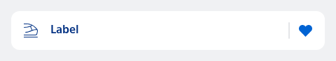
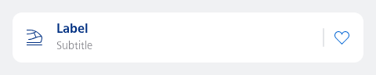

#### Single, contained, label only



```kotlin
var favourite by remember { mutableStateOf(true) }
NesListItemSearchSuggestion(
    icon = R.drawable.ic_nes_cropped_train_ic_alt,
    label = "Label",
    trailingIcon = if (favourite) R.drawable.ic_nes_cropped_heart_filled else R.drawable.ic_nes_cropped_heart,
    type = NesListItemType.Single,
    onTrailingIconClick = {
        favourite = !favourite
        println("Trailing icon clicked")
    },
    onClick = { println("Item clicked") }
)
```

#### Single, contained, label and subtext



```kotlin
var favourite by remember { mutableStateOf(false) }
NesListItemSearchSuggestion(
    icon = R.drawable.ic_nes_cropped_train_ic_alt,
    label = "Label",
    subtext = "Subtitle",
    trailingIcon = if (favourite) R.drawable.ic_nes_cropped_heart_filled else R.drawable.ic_nes_cropped_heart,
    type = NesListItemType.Single,
    onTrailingIconClick = {
        favourite = !favourite
        println("Trailing icon clicked")
    },
    onClick = { println("Item clicked") }
)
```

