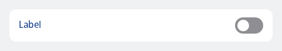
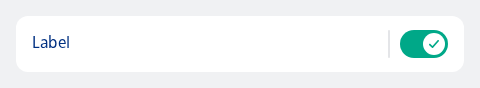

#### Single, contained, whole item is toggleable



```kotlin
NesListItemToggle(
    label = "Label",
    state = NesToggleableState.Off,
    type = NesListItemType.Single,
    onClick = { newState ->
        println("Toggle item clicked: $newState")
    }
)
```

#### Single, contained, toggle is separately toggleable from the list item



```kotlin
NesListItemToggle(
    label = "Label",
    state = NesToggleableState.On,
    type = NesListItemType.Single,
    toggleContentDescription = "Optional toggle content description",
    onCheckedChange = { newState ->
        println("Toggle item clicked: $newState")
    },
    onClick = { println("Item clicked") }
)
```

