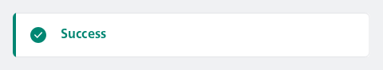
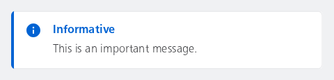
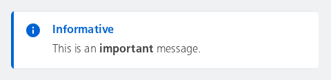
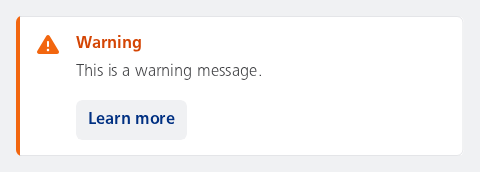

#### Label only



```kotlin
NesMessageInline(
    type = NesMessageInlineType.Success,
    label = "Success"
)
```

#### Label and subtext only



```kotlin
NesMessageInline(
    type = NesMessageInlineType.Info,
    label = "Informative",
    subtext = "This is an important message."
)
```

#### Label and subtext as annotated string only

The text "important" will be displayed in bold.



```kotlin
NesMessageInline(
    type = NesMessageInlineType.Info,
    label = "Informative",
    subtext = buildAnnotatedString {
        append("This is an ")
        withStyle(SpanStyle(fontWeight = FontWeight.Bold)) {
            append("important")
        }
        append(" message.")
    }
)
```

#### Label and a button

This sample demonstrates how to use the message inline component with a label and a button. Subtext is required when having a button. The button can be used to perform an action when clicked, such as navigating to a detailed page or showing more information about the message.



```kotlin
NesMessageInline(
    type = NesMessageInlineType.Warning,
    label = "Warning",
    subtext = "This is a warning message.",
    buttonLabel = "Learn more",
    onButtonClick = { /* Handle button click */ },
)
```

