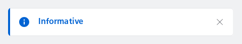
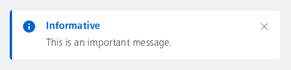
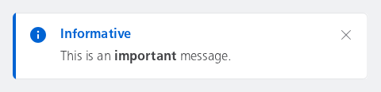
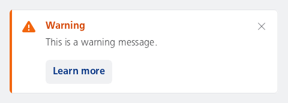
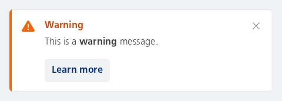

#### Dismissible with only a label



```kotlin
NesMessageInlineDismissible(
    type = NesMessageInlineType.Info,
    label = "Informative",
    onDismiss = { /* Handle dismiss */ }
)
```

#### Dismissible with a label and subtext

This is a basic example of how to use the NesMessageInlineDismissible component. It creates a message that can be dismissed by the user.



```kotlin
NesMessageInlineDismissible(
    type = NesMessageInlineType.Info,
    label = "Informative",
    subtext = "This is an important message.",
    onDismiss = { /* Handle dismiss */ }
)
```

#### Dismissible with a label and annotated subtext

This is a basic example of how to use the NesMessageInlineDismissible component. It creates a message that can be dismissed by the user. The word "important" is displayed in bold.



```kotlin
NesMessageInlineDismissible(
    type = NesMessageInlineType.Info,
    label = "Informative",
    subtext = buildAnnotatedString {
        append("This is an ")
        withStyle(SpanStyle(fontWeight = FontWeight.Bold)) {
            append("important")
        }
        append(" message.")
    },
    onDismiss = { /* Handle dismiss */ }
)
```

#### Dismissible with a label and a button

This sample demonstrates how to use the message inline dismissible component with a label and a button. The button can be used to perform an action when clicked, such as navigating to a detailed page or showing more information about the message.



```kotlin
NesMessageInlineDismissible(
    type = NesMessageInlineType.Warning,
    label = "Warning",
    subtext = "This is a warning message.",
    buttonLabel = "Learn more",
    onButtonClick = { /* Handle button click */ },
    onDismiss = { /* Handle dismiss */ }
)
```

#### Dismissible with a label, annotated subtext and a button

This sample demonstrates how to use the message inline dismissible component with a label and a button. The word "warning" is displayed in bold. The button can be used to perform an action when clicked, such as navigating to a detailed page or showing more information about the message.



```kotlin
NesMessageInlineDismissible(
    type = NesMessageInlineType.Warning,
    label = "Warning",
    subtext = buildAnnotatedString {
        append("This is a ")
        withStyle(SpanStyle(fontWeight = FontWeight.Bold)) {
            append("warning")
        }
        append(" message.")
    },
    buttonLabel = "Learn more",
    onButtonClick = { /* Handle button click */ },
    onDismiss = { /* Handle dismiss */ }
)
```

