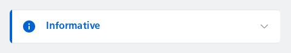
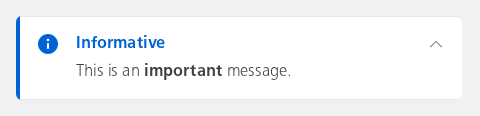
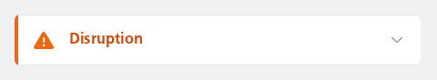
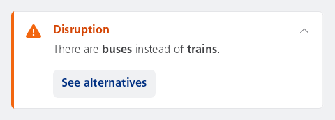

#### Collapsed with a label and subtext

This is a basic example of how to use the NesMessageInlineExpandable component. It creates a message that can be expanded by the user.



```kotlin
var expanded by remember { mutableStateOf(false) }
NesMessageInlineExpandable(
    type = NesMessageInlineType.Info,
    label = "Informative",
    subtext = "This is an important message.",
    expanded = expanded,
    onExpandedChange = { expanded = it },
)
```

#### Expanded with a label and annotated subtext

This is a basic example of how to use the NesMessageInlineExpandable component. It creates a message that can be expanded by the user. The word "important" is displayed in bold.



```kotlin
var expanded by remember { mutableStateOf(true) }
NesMessageInlineExpandable(
    type = NesMessageInlineType.Info,
    label = "Informative",
    subtext = buildAnnotatedString {
        append("This is an ")
        withStyle(SpanStyle(fontWeight = FontWeight.Bold)) {
            append("important")
        }
        append(" message.")
    },
    expanded = expanded,
    onExpandedChange = { expanded = it },
)
```

#### Collapsed with a label, subtext and button

This is a more advanced example of how to use the NesMessageInlineExpandable component. It creates a message that can be expanded by the user and includes a button for additional actions.



```kotlin
var expanded by remember { mutableStateOf(false) }
NesMessageInlineExpandable(
    type = NesMessageInlineType.Warning,
    label = "Disruption",
    subtext = "There are buses instead of trains.",
    buttonLabel = "See alternatives",
    expanded = expanded,
    onButtonClick = { /* Handle button click */ },
    onExpandedChange = { expanded = it },
)
```

#### Expanded with a label, annotated subtext and button

This is a more advanced example of how to use the NesMessageInlineExpandable component. It creates a message that can be expanded by the user and includes a button for additional actions. The words "buses" and "trains" are displayed in bold.



```kotlin
var expanded by remember { mutableStateOf(true) }
NesMessageInlineExpandable(
    type = NesMessageInlineType.Warning,
    label = "Disruption",
    subtext = buildAnnotatedString {
        append("There are ")
        withStyle(SpanStyle(fontWeight = FontWeight.Bold)) {
            append("buses")
        }
        append(" instead of ")
        withStyle(SpanStyle(fontWeight = FontWeight.Bold)) {
            append("trains")
        }
        append(".")
    },
    buttonLabel = "See alternatives",
    expanded = expanded,
    onButtonClick = { /* Handle button click */ },
    onExpandedChange = { expanded = it },
)
```

