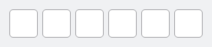
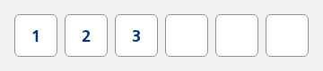
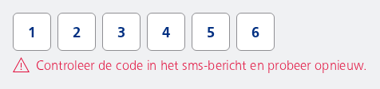
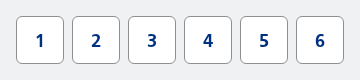
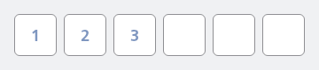
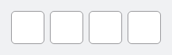

#### Default empty OTP input



```kotlin
var value by remember { mutableStateOf("") }
NesOTPInput(
    value = value,
    onValueChange = { newValue ->
        value = newValue
    }
)
```

#### OTP Input with prefilled value

Prefilled value of `123` will be shown, with cursor at the end of the input.



```kotlin
var value by remember { mutableStateOf("123") }
NesOTPInput(
    value = value,
    onValueChange = { newValue ->
        value = newValue
    }
)
```

#### Error state

Wiggle animation will play and `value` will be emptied automatically after the animation is finished. Readonly is automatically set to `true` to prevent user input while the animation is playing.



```kotlin
var value by remember { mutableStateOf("123456") }
NesOTPInput(
    value = value,
    errorMessage = "Controleer de code in het sms-bericht en probeer opnieuw.",
    onValueChange = { newValue ->
        value = newValue
    }
)
```

#### Read-only OTP input

User can't edit the OTP input. OTP value of `123456` will be displayed.



```kotlin
var value by remember { mutableStateOf("123456") }
NesOTPInput(
    value = value,
    readOnly = true,
    onValueChange = { newValue ->
        value = newValue
    }
)
```

#### Disabled OTP input

User can't edit the OTP input. OTP value of `123` will be displayed. All shown in a disabled state.



```kotlin
var value by remember { mutableStateOf("123") }
NesOTPInput(
    value = value,
    enabled = false,
    onValueChange = { newValue ->
        value = newValue
    }
)
```

#### OTP with 4 digits



```kotlin
var value by remember { mutableStateOf("") }
NesOTPInput(
    value = value,
    length = 4,
    onValueChange = { newValue ->
        value = newValue
    }
)
```

#### Custom horizontal arrangement

Centre the input fields horizontally instead of Start aligned and custom spaced by 2.dp


```kotlin
var value by remember { mutableStateOf("") }
NesOTPInput(
    value = value,
    horizontalArrangement = Arrangement.spacedBy(2.dp, Alignment.CenterHorizontally),
    onValueChange = { newValue ->
        value = newValue
    },
    modifier = Modifier.fillMaxWidth()
)
```

