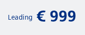
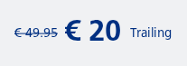
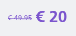
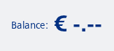
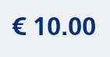

#### Show a price with leading text



```kotlin
NesPrice(
    priceInCents = 99900,
    leadingText = "Leading"
)
```

#### Price with discount and trailing text



```kotlin
NesPrice(
    priceInCents = 2000,
    previousPriceInCents = 4995,
    trailingText = "Trailing"
)
```

#### Price with alternate colour



```kotlin
NesPrice(
    priceInCents = 2000,
    previousPriceInCents = 4995,
    color = NesTokens.colors.systemHighlightDefault
)
```

#### Unknown price with leading text



```kotlin
NesPrice(
    priceInCents = null,
    leadingText = "Balance:"
)
```

#### Stacked price with leading and trailing text


```kotlin
NesPrice(
    leadingText = "Leading",
    trailingText = "Trailing",
    priceInCents = 99900,
    stacked = true
)
```

#### Always show decimals

Forces the price to be formatted with two decimal places even for round amounts. Example: `priceInCents = 1000` -> "€ 10.00" (instead of "€ 10"). Useful for consistent column alignment or when you want to emphasize cents.



```kotlin
NesPrice(
    priceInCents = 1000,
    alwaysShowDecimals = true
)
```

