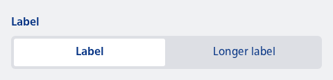

#### Panel with label and 2 items



```kotlin
var state by remember { mutableIntStateOf(0) }
val titles = listOf("Label", "Longer label")
NesFormRow(
    label = "Label"
) {
    NesRadioPanel(selectedRadioIndex = state) {
        titles.forEachIndexed { index, title ->
            NesRadioPanelItem(
                selected = state == index,
                text = title,
                onClick = {
                    state = index
                }
            )
        }
    }
}
```

