#### Custom content

*DEPRECATED* Use `NesRouteItem` instead. Shows the departure navigation bone, time (and delay), location, platform, carrier and a custom composable (in this case a Sticker with "NS Prijstijd Deal").

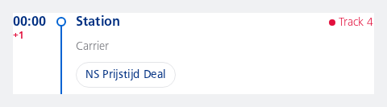

```kotlin
NesRoute(
    boneType = NesBoneType.Departure,
    time = "00:00",
    delay = "+1",
    location = "Station",
    carrier = "Carrier",
    trailingText = "Track 3",
    updatedTrailingText = "Track 4",
    content = {
        NesSticker(
            text = "NS Prijstijd Deal",
            filled = false
        )
    }
)
```

#### Alternative font weight

*DEPRECATED* Use `NesRouteItem` instead. Shows the time and location ("00:00" and "Station") in a Normal font weight instead of the default Bold.

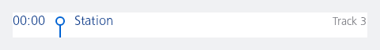

```kotlin
NesRoute(
    boneType = NesBoneType.Departure,
    time = "00:00",
    location = "Station",
    trailingText = "Track 3",
    weight = NesRouteWeight.Normal
)
```

#### Location only

*DEPRECATED* Use `NesRouteItem` instead. Shows the departure navigation bone, location and platform only.

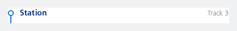

```kotlin
NesRoute(
    boneType = NesBoneType.Departure,
    location = "Station",
    trailingText = "Track 3"
)
```

#### Cancelled

*DEPRECATED* Use `NesRouteItem` instead. Showing a cancelled leg.

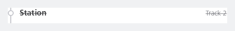

```kotlin
NesRoute(
    boneType = NesBoneType.Location,
    location = "Station",
    trailingText = "Track 2",
    cancelled = true
)
```

#### Cancelled, no strike-through for location

*DEPRECATED* This variant is not possible with the new `NesRouteItem` Showing a cancelled leg but without the location having a strike-through. In some cases this is needed, by default the `locationStrikeThrough` option follows the `cancelled` property.

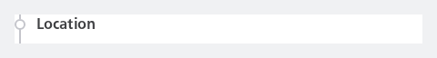

```kotlin
NesRoute(
    boneType = NesBoneType.Location,
    location = "Location",
    cancelled = true,
    locationStrikeThrough = false
)
```

#### Ellipsize location

*DEPRECATED* Use `NesRouteItem` instead. The location name will be displayed truncated with an ellipsis if it is too long, e.g., "Amsterdam Bijlmer...". The trailing text, such as "Track 2," will be shown after the location. The entire location will be constrained to a single line and will not wrap onto multiple lines.

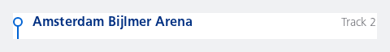

```kotlin
NesRoute(
    boneType = NesBoneType.Departure,
    location = "Amsterdam Bijlmer Arena",
    singleLineLocation = true,
    trailingText = "Track 2"
)
```

#### Multiple route items and messages within a vertically (scrolling) list

This sample uses a LazyColumn with consistent vertical spacing between items defined by `NesRouteItemDefaults.ITEM_SPACING`. It shows how to render NesRouteItem components alongside NesRouteMessage components, including messages without a time value (empty string) to preserve alignment by reserving space for the time display. The example includes route steps with various states such as normal, cancelled, and error messages at the start and end to indicate missed check-ins or check-outs.

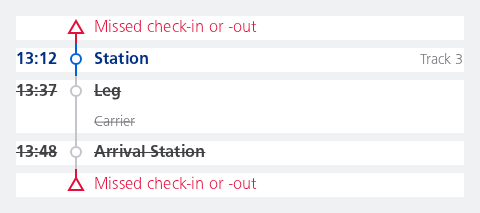

```kotlin
LazyColumn(verticalArrangement = Arrangement.spacedBy(NesRouteItemDefaults.ITEM_SPACING.dp)) {
    item {
        NesRouteMessage(
            boneType = NesBoneType.ErrorStart,
            time = "",
            message = "Missed check-in or -out"
        )
    }
    item {
        NesRouteItem(
            boneType = NesBoneType.Location,
            time = "13:12",
            location = "Station",
            trailingText = "Track 3"
        )
    }
    item {
        NesRouteItem(
            boneType = NesBoneType.Location,
            time = "13:37",
            location = "Leg",
            carrier = "Carrier",
            cancelled = true
        )
    }
    item {
        NesRouteItem(
            boneType = NesBoneType.Location,
            time = "13:48",
            location = "Arrival Station",
            cancelled = true
        )
    }
    item {
        NesRouteMessage(
            boneType = NesBoneType.ErrorEnd,
            time = "",
            message = "Missed check-in or -out"
        )
    }
}
```

#### Spacing

Show empty space before the route line.

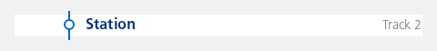

```kotlin
// Set time to an empty string instead of `null` to show some space in front of the boneType
NesRouteItem(
    boneType = NesBoneType.Location,
    location = "Station",
    trailingText = "Track 2",
    time = ""
)
```

#### Alternative font weight

Shows the time and location ("00:00" and "Station") in a Normal font weight instead of the default Bold.

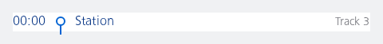

```kotlin
NesRouteItem(
    boneType = NesBoneType.Departure,
    time = "00:00",
    location = "Station",
    trailingText = "Track 3",
    weight = NesRouteWeight.Normal
)
```

#### Location only

Shows the departure navigation bone, location and platform only.

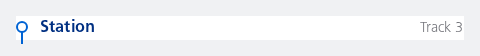

```kotlin
NesRouteItem(
    boneType = NesBoneType.Departure,
    location = "Station",
    trailingText = "Track 3"
)
```

#### Cancelled

Showing a cancelled leg.


```kotlin
NesRouteItem(
    boneType = NesBoneType.Location,
    location = "Station",
    trailingText = "Track 2",
    cancelled = true
)
```

#### Cancelled, no strike-through for location

Showing a cancelled leg but without the location having a strike-through, still rendering in the cancelled grey colour state. In some cases this is needed, by default the `locationStrikeThrough` option follows the `cancelled` property.

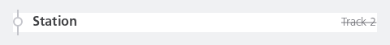

```kotlin
NesRouteItem(
    boneType = NesBoneType.Location,
    location = "Station",
    trailingText = "Track 2",
    cancelled = true,
    locationStrikeThrough = false
)
```

#### Cancelled, no strike-through for carrier

Showing a cancelled leg but without the carrier being cancelled (no strike-through). In some cases this is needed, by default the `carrierCancelled` option follows the `cancelled` property.

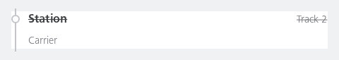

```kotlin
NesRouteItem(
    boneType = NesBoneType.Location,
    location = "Station",
    carrier = "Carrier",
    trailingText = "Track 2",
    cancelled = true,
    carrierCancelled = false
)
```

#### Ellipsize location

The location name will be displayed truncated with an ellipsis if it is too long, e.g., "Amsterdam Bijlmer...". The trailing text, such as "Track 2," will be shown after the location. The entire location will be constrained to a single line and will not wrap onto multiple lines.

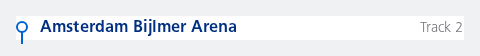

```kotlin
NesRouteItem(
    boneType = NesBoneType.Departure,
    location = "Amsterdam Bijlmer Arena",
    singleLineLocation = true,
    trailingText = "Track 2"
)
```

#### Custom content

Shows the departure navigation bone, time (and delay), location, platform, carrier and a custom composable (in this case a Sticker with "NS Prijstijd Deal").

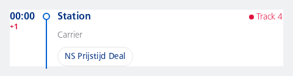

```kotlin
NesRouteItem(
    boneType = NesBoneType.Departure,
    time = "00:00",
    delay = "+1",
    location = "Station",
    carrier = "Carrier",
    trailingText = "Track 3",
    updatedTrailingText = "Track 4",
    content = {
        NesSticker(
            text = "NS Prijstijd Deal",
            filled = false
        )
    }
)
```

#### Error Start

Show an error message at the start of the trip.

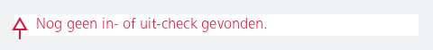

```kotlin
NesRouteMessage(
    boneType = NesBoneType.ErrorStart,
    message = "Nog geen in- of uit-check gevonden.",
)
```

#### Error End

Show error at the end of a list, e.g. for a forgotten in- or out-check.

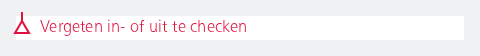

```kotlin
NesRouteMessage(
    boneType = NesBoneType.ErrorEnd,
    message = "Vergeten in- of uit te checken",
)
```

#### Error End with additional description

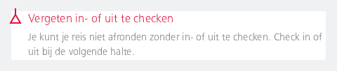

```kotlin
NesRouteMessage(
    boneType = NesBoneType.ErrorEnd,
    message = "Vergeten in- of uit te checken",
    description = "Je kunt je reis niet afronden zonder in- of uit te checken. Check in of uit bij de volgende halte."
)
```

#### Additional empty spacing

Show a message with an additional empty space before the error indication icon.

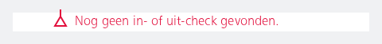

```kotlin
// Set time to an empty string instead of `null` to show some space in front of the boneType
NesRouteMessage(
    boneType = NesBoneType.ErrorEnd,
    message = "Nog geen in- of uit-check gevonden.",
    time = ""
)
```

#### Bold text weight

Show error (and time) in a Bold font weight instead of the default Normal.

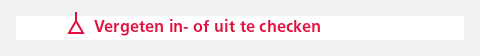

```kotlin
NesRouteMessage(
    boneType = NesBoneType.ErrorEnd,
    message = "Vergeten in- of uit te checken",
    time = "",
    weight = NesRouteWeight.Bold
)
```

#### Error End with additional annotated description

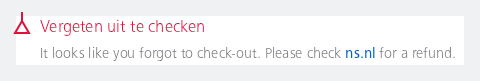

```kotlin
NesRouteMessage(
    boneType = NesBoneType.ErrorEnd,
    message = "Vergeten uit te checken",
    description = buildAnnotatedString {
        append("It looks like you forgot to check-out. Please check ")
        withStyle(style = SpanStyle(
            color = NesTokens.applied.interactionColorActive,
            fontWeight = NesFontWeight.Demi
        )) {
            append("ns.nl")
        }
        append(" for a refund.")
    }
)
```

