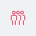
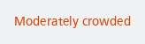

#### Icon (calm), default, in 32x32 bounding box


```kotlin
NesRush(status = NesRushStatus.Calm)
```

#### Icon (busy), cropped



```kotlin
NesRush(
    status = NesRushStatus.Busy,
    size = NesRushSize.Cropped
)
```

#### Text (average)



```kotlin
NesRush(
    status = NesRushStatus.Average,
    type = NesRushType.Text
)
```

