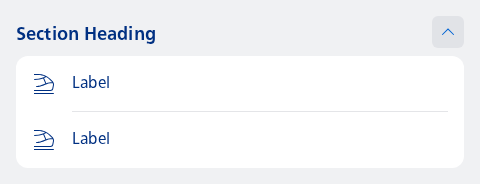
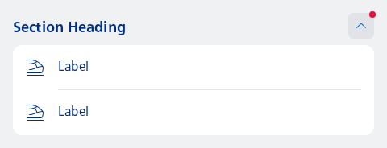
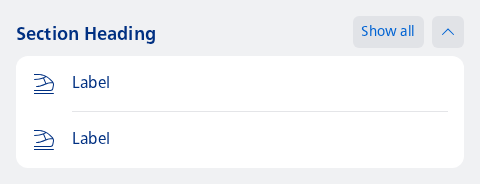

#### Basic usage example



```kotlin
var expanded by rememberSaveable { mutableStateOf(true) }
NesSectionHeadingDisclosure(
    title = "Section Heading",
    isExpanded = expanded,
    onExpandChange = { expanded = it }
) {
    Column {
        val count = 2
        repeat(count) { index ->
            NesListItemNavigation(
                type = NesListItemType.fromIndex(index, count),
                icon = R.drawable.ic_nes_cropped_train_ic_alt,
                label = "Label",
                onClick = { }
            )
        }
    }
}
```

#### Show a badge on the expand button



```kotlin
var expanded by rememberSaveable { mutableStateOf(true) }
NesSectionHeadingDisclosure(
    title = "Section Heading",
    isExpanded = expanded,
    showBadge = true,
    onExpandChange = { expanded = it }
) {
    Column {
        val count = 2
        repeat(count) { index ->
            NesListItemNavigation(
                type = NesListItemType.fromIndex(index, count),
                icon = R.drawable.ic_nes_cropped_train_ic_alt,
                label = "Label",
                onClick = { }
            )
        }
    }
}
```

#### Collapsed state with divider


```kotlin
var expanded by rememberSaveable { mutableStateOf(false) }
NesSectionHeadingDisclosure(
    title = "Section Heading",
    isExpanded = expanded,
    onExpandChange = { expanded = it }
) {
    Column {
        val count = 2
        repeat(count) { index ->
            NesListItemNavigation(
                type = NesListItemType.fromIndex(index, count),
                icon = R.drawable.ic_nes_cropped_train_ic_alt,
                label = "Label",
                onClick = { }
            )
        }
    }
}
```

#### Collapsed state without divider


```kotlin
var expanded by rememberSaveable { mutableStateOf(false) }
NesSectionHeadingDisclosure(
    title = "Section Heading",
    isExpanded = expanded,
    showDivider = false,
    onExpandChange = { expanded = it }
) {
    Column {
        val count = 2
        repeat(count) { index ->
            NesListItemNavigation(
                type = NesListItemType.fromIndex(index, count),
                icon = R.drawable.ic_nes_cropped_train_ic_alt,
                label = "Label",
                onClick = { }
            )
        }
    }
}
```

#### Additional actions that belong to the section



```kotlin
var expanded by rememberSaveable { mutableStateOf(true) }
NesSectionHeadingDisclosure(
    title = "Section Heading",
    isExpanded = expanded,
    onExpandChange = { expanded = it },
    actions = {
        LabelButton(
            label = "Show all",
            onClick = { /* Handle: show all button clicked */ }
        )
    }
) {
    Column {
        val count = 2
        repeat(count) { index ->
            NesListItemNavigation(
                type = NesListItemType.fromIndex(index, count),
                icon = R.drawable.ic_nes_cropped_train_ic_alt,
                label = "Label",
                onClick = { }
            )
        }
    }
}
```

