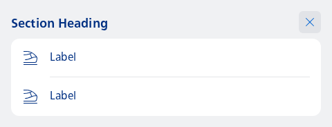
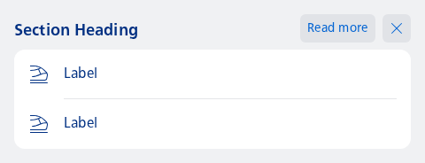

#### Basic usage example



```kotlin
NesSectionHeadingDismissible(
    title = "Section Heading",
    onDismiss = { /* Handle: Dismiss click */ }
) {
    Column {
        val count = 2
        repeat(count) { index ->
            NesListItemNavigation(
                type = NesListItemType.fromIndex(index, count),
                icon = R.drawable.ic_nes_cropped_train_ic_alt,
                label = "Label",
                onClick = { }
            )
        }
    }
}
```

#### Additional actions that belong to the section



```kotlin
NesSectionHeadingDismissible(
    title = "Section Heading",
    actions = {
        LabelButton(
            label = "Read more",
            onClick = { /* Handle: read more button clicked */ }
        )
    },
    onDismiss = { /* Handle: Dismiss click */ }
) {
    Column {
        val count = 2
        repeat(count) { index ->
            NesListItemNavigation(
                type = NesListItemType.fromIndex(index, count),
                icon = R.drawable.ic_nes_cropped_train_ic_alt,
                label = "Label",
                onClick = { }
            )
        }
    }
}
```

