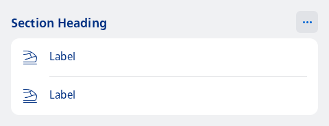

#### Basic usage example



```kotlin
NesSectionHeadingOptions(
    title = "Section Heading",
    options = listOf("Option 1", "Option 2"),
    optionLabel = { it },
    onOptionClicked = { /* Handle: Option click */ }
) {
    Column {
        val count = 2
        repeat(count) { index ->
            NesListItemNavigation(
                type = NesListItemType.fromIndex(index, count),
                icon = R.drawable.ic_nes_cropped_train_ic_alt,
                label = "Label",
                onClick = { }
            )
        }
    }
}
```

#### Custom data class and popup menu with icons


```kotlin
data class MenuOption(
    val id: Int,
    @param:DrawableRes val icon: Int,
    val title: String
)

val options = listOf(
    MenuOption(1, R.drawable.ic_nes_cropped_check_thick, "Save"),
    MenuOption(2, R.drawable.ic_nes_cropped_share_android, "Share"),
)

NesSectionHeadingOptions(
    title = "Section Heading",
    options = options,
    optionLabel = { it.title },
    optionItem = {
        NesIcon(
            icon = it.icon,
            type = NesIconType.Cropped
        )
        NesText(text = it.title)
    },
    onOptionClicked = { /* Handle: Option click */ }
) {
    Column {
        val count = 2
        repeat(count) { index ->
            NesListItemNavigation(
                type = NesListItemType.fromIndex(index, count),
                icon = R.drawable.ic_nes_cropped_train_ic_alt,
                label = "Label",
                onClick = { }
            )
        }
    }
}
```

