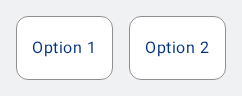

#### Selectable sample with multiple options



```kotlin
class SelectableOptions(
    text: String,
    selected: Boolean
) {
    var text by mutableStateOf(text)
    var selected by mutableStateOf(selected)
}

val options = remember {
    mutableStateListOf(
        SelectableOptions("Option 1", false),
        SelectableOptions("Option 2", false),
    )
}

Row(
    horizontalArrangement = Arrangement.spacedBy(16.dp)
) {
    options.forEach { option ->
        NesSelectable(
            contentPadding = PaddingValues(horizontal = 16.dp, vertical = 20.dp),
            selected = option.selected,
            onClick = {
                option.selected = !option.selected
            }
        ) {
            NesText(text = option.text)
        }
    }
}
```

