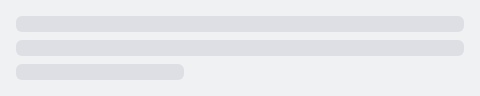
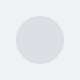

#### Skeleton loader with 3 lines of text



```kotlin
NesSkeleton(
    shape = NesSkeletonShape.Text,
    textLines = 3
)
```

#### Skeleton loader as a circle

Example showing a circle that could be interpreted as a user avatar.



```kotlin
NesSkeleton(
    shape = NesSkeletonShape.Circle,
    contentDescription = "User avatar"
)
```

