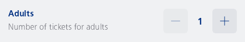
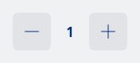

#### Stepper with a label and help text

A sample of a labelled stepper that allows the user to select a value in the range of 1 to 10.



```kotlin
NesLabeledStepper(
    label = "Adults",
    helpText = "Number of tickets for adults",
) {
    var value by remember { mutableIntStateOf(1) }
    NesStepper(
        value = value,
        range = 1..10,
    ) {
        value = it
    }
}
```

#### Accessibility example

A sample of a stepper that allows the user to select a value in the range of 0 to 30 minutes, with a step size of 5 minutes. This example demonstrates how to use the stepper with accessibility features, such as providing a unit for the value (e.g., "minutes"). This is useful for scenarios where the stepper is used to select a time duration, such as setting additional time for changing trains or other time-based operations.



```kotlin
var value by remember { mutableIntStateOf(1) }
NesStepper(
    value = value,
    range = 0..30,
    stepSize = 5,
    onStepperChanged = { value = it },
    unit = "minutes",
)
```

