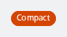
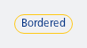
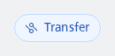

#### Default


```kotlin
NesSticker(text = "Sticker")
```

#### Compact, with attention style



```kotlin
NesSticker(
    text = "Compact",
    type = NesStickerType.Attention,
    size = NesStickerSize.Compact
)
```

#### Bordered, brand styling



```kotlin
NesSticker(
    text = "Bordered",
    type = NesStickerType.Brand,
    size = NesStickerSize.Compact,
    filled = false
)
```

#### Icon, bordered and with info styling

Behaviour: - size: only the 'xs' size is supported. Other sizes are ignored/unsupported. - compact variant: when sticker size 'compact' is used, the icon will not be shown.



```kotlin
NesSticker(
    icon = IconSize.Xs.Transfer,
    text = "Transfer",
    type = NesStickerType.Info,
    filled = false
)
```

