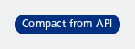

#### Use a size from the API.

To provide a `NesStickerSize` from an API perspective, you can use the `toNesStickerSize()` String extension function. This example converts "compact" to `NesStickerSize.Compact`. Unknown types will default to `NesStickerSize.Default`.



```kotlin
NesSticker(
    text = "Compact from API",
    size = "compact".toNesStickerSize()
)
```

