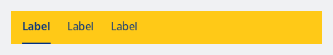
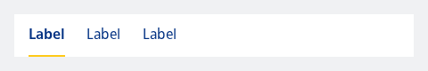

#### Tabs Default example

A sample of a NesTabRow with the Default style.



```kotlin
NesTabRow(
    selectedTabIndex = 0,
    items = listOf("Label", "Label", "Label"),
    type = NesTabsType.Default,
    onClick = {
        println("Clicked tab index: $it")
    }
)
```

#### Tabs Inline example

A sample of a NesTabRow with the Inline style.



```kotlin
NesTabRow(
    selectedTabIndex = 0,
    items = listOf("Label", "Label", "Label"),
    type = NesTabsType.Inline,
    onClick = {
        println("Clicked tab index: $it")
    }
)
```

#### Tabs Inline example with divider

A sample of a NesTabRow with the Inline style with the divider enabled. This only works for the Inline type.


```kotlin
NesTabRow(
    selectedTabIndex = 0,
    items = listOf("Label", "Label", "Label"),
    divider = true,
    type = NesTabsType.Inline,
    onClick = {
        println("Clicked tab index: $it")
    }
)
```

