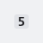
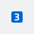
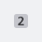

#### Neutral



```kotlin
NesTagLine(
    variant = NesTagLineVariant.Neutral,
    line = "5",
    contentDescription = "Buslijn 5",
)
```

#### Blue



```kotlin
NesTagLine(
    variant = NesTagLineVariant.LightBlue,
    line = "3",
    contentDescription = "Metrolijn 3",
)
```

#### Cancelled



```kotlin
NesTagLine(
    variant = NesTagLineVariant.Cancelled,
    line = "2",
    contentDescription = "Buslijn 2, Cancelled",
)
```

