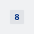
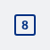
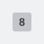
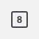
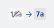
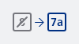
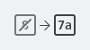

#### Default Neutral

Show location (Track / Platform) "8" in the Neutral colour set



```kotlin
NesTagLocation(
    variant = NesTagLocationVariant.Neutral,
    location = "8",
    state = NesTagLocationState.Default,
    contentDescription = "Platform",
)
```

#### Default Blue

Show location (Track / Platform) "8" in the Blue colour set



```kotlin
NesTagLocation(
    variant = NesTagLocationVariant.Blue,
    location = "8",
    state = NesTagLocationState.Default,
    contentDescription = "Platform",
)
```

#### Cancelled Neutral

Show cancelled location (Track / Platform) "8" in the Neutral colour set



```kotlin
NesTagLocation(
    variant = NesTagLocationVariant.Neutral,
    location = "8",
    state = NesTagLocationState.Cancelled,
    contentDescription = "Platform",
)
```

#### Cancelled Blue

Show cancelled location (Track / Platform) "8" in the Blue colour set



```kotlin
NesTagLocation(
    variant = NesTagLocationVariant.Blue,
    location = "8",
    state = NesTagLocationState.Cancelled,
    contentDescription = "Platform",
)
```

#### Changed Neutral

Show changed location (Track / Platform) "7a" from Track "18a" in the Neutral colour set



```kotlin
// Show a changed location from track 18a to 7a
NesTagLocation(
    variant = NesTagLocationVariant.Neutral,
    location = "18a",
    state = NesTagLocationState.Changed("7a"),
    contentDescription = "Platform",
)
```

#### Changed Blue

Show changed location (Track / Platform) "7a" from Track "8" in the Blue colour set



```kotlin
// Show a changed location from track 8 to 7a
NesTagLocation(
    variant = NesTagLocationVariant.Blue,
    location = "8",
    state = NesTagLocationState.Changed("7a"),
    contentDescription = "Platform",
)
```

#### Changed and Cancelled Blue

Show changed and cancelled location (Track / Platform) "7a" from Track "8" in the Blue colour set



```kotlin
// Show a changed and cancelled location from track 8 to 7a
NesTagLocation(
    variant = NesTagLocationVariant.Blue,
    location = "8",
    state = NesTagLocationState.Changed("7a", state = NesTagLocationState.Cancelled),
    contentDescription = "Platform",
)
```

