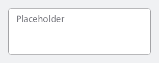
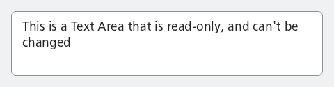
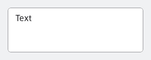

#### Text area with placeholder



```kotlin
var value by remember { mutableStateOf("") }
NesTextArea(
    value = value,
    onValueChange = { value = it },
    placeholder = "Placeholder"
)
```

#### Read-Only text area



```kotlin
var value by remember {
    mutableStateOf("This is a Text Area that is read-only, and can't be changed")
}
NesTextArea(
    value = value,
    onValueChange = { value = it },
    readOnly = true
)
```

#### Default text area

Sample showing how to use a TextFieldValue in combination with the Text Area



```kotlin
var value by remember { mutableStateOf(TextFieldValue("Text")) }
NesTextArea(
    value = value,
    onValueChange = { value = it }
)
```

