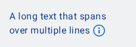

#### Annotated String with icon at a custom position

This example shows how to use an [AnnotatedString] with an icon at a custom position. The button is inserted at the position of the `[icon]` placeholder with the content description "More info".


```kotlin
NesTextWithIcon(
    text = buildAnnotatedString {
        append("Book a [icon]")
        withStyle(SpanStyle(
            fontWeight = FontWeight.Bold
        )) {
            append("Taxi")
        }
    },
    icon = R.drawable.ic_nes_32x32_info_thick,
    buttonContentDescription = "More info",
    onClick = { },
)
```

#### (Long) Text with icon at the end

This example shows how to use a long text with an icon at the end. The icon is automatically placed at the end of the text when no `[icon]` placeholder is found.



```kotlin
NesTextWithIcon(
    modifier = Modifier.width(200.dp),
    text = "A long text that spans over multiple lines",
    icon = R.drawable.ic_nes_32x32_info_thick,
    buttonContentDescription = "More info",
    onClick = { },
)
```

