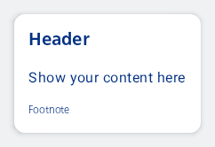
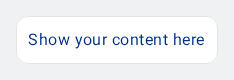
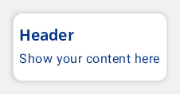

#### Default layout

Shows a tile container with a header, content and footer.



```kotlin
NesTileContainer(
    header = { NesHeading("Header", style = NesTokens.typography.heading3) },
    content = { NesText("Show your content here") },
    footer = { NesText("Footnote", style = NesTokens.typography.footnote) },
)
```

#### Dense layout with border and no elevation



```kotlin
NesTileContainer(
    density = NesTileContainerDensity.Dense,
    border = true,
    elevation = 0.dp
) {
    NesText("Show your content here")
}
```

#### Custom spacings and insets

Alter the tile container to render with custom spacing between elements (2.dp) and a custom inset with horizontal padding set to 8.dp and vertical to 16.dp.



```kotlin
NesTileContainer(
    density = NesTileContainerDensity.Custom(
        customSpacing = 2.dp,
        customInsets = PaddingValues(horizontal = 8.dp, vertical = 16.dp)
    ),
    border = true,
    header = { NesHeading("Header", style = NesTokens.typography.heading3) },
    content = { NesText("Show your content here") },
)
```

