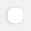
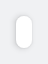
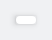

#### No spacing, with default insets (padding)

Alter the tile container to render with no spacing between elements.



```kotlin
NesTileContainer(
    density = NesTileContainerDensity.Custom(0.dp)
) {
   // Content
}
```

#### Small spacing, with custom horizontal and vertical insets

Alter the tile container to render with custom spacing between elements (2.dp) and a custom inset with horizontal padding set to 8.dp and vertical to 16.dp.



```kotlin
NesTileContainer(
    density = NesTileContainerDensity.Custom(
        customSpacing = 2.dp,
        customInsets = PaddingValues(horizontal = 8.dp, vertical = 16.dp)
    )
) {
    // Content
}
```

#### Custom insets for top, start, end and bottom



```kotlin
NesTileContainer(
    density = NesTileContainerDensity.Custom(
        customSpacing = 2.dp,
        customInsets = PaddingValues(
            top = 6.dp,
            start = 4.dp,
            end = 16.dp,
            bottom = 2.dp
        )
    )
) {
    // Content
}
```

