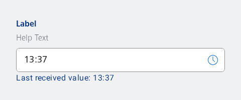

#### Time input

Either input the time in the input field or use the dialog by clicking the action button.



```kotlin
val timeInputPlaceholder = stringResource(id = R.string.nes_timeinput_placeholder)
val time = LocalTime.now()

var value by remember { mutableStateOf(LocalTime.of(time.hour, time.minute)) }
var openDialog by remember { mutableStateOf(false) }

if (openDialog) {
    NesTimePicker(
        onTimeSelected = { value = it },
        onDismissRequest = {
            openDialog = false
        },
        currentTime = value,
        buttonCancelTestTag = "time-picker",
        buttonConfirmTestTag = "time-picker"
    )
}

NesFormRow(
    label = "Label",
    helpText = "Help Text",
    optional = false,
    modifier = Modifier.padding(NesTheme.dimens.spacing_4),
    testTag = "input-example-row"
) {
    NesTimePickerInput(
        value = value,
        onValueChange = { value = it },
        placeholder = timeInputPlaceholder,
        onActionClick = { openDialog = true },
    )
    NesText(
        text = "Last received value: $value"
    )
}
```

#### Time picker

Always use the dialog to select the time.


```kotlin
val timeInputPlaceholder = stringResource(id = R.string.nes_timeinput_placeholder)
val time = LocalTime.now()

var value by remember { mutableStateOf(LocalTime.of(time.hour, time.minute)) }
var openDialog by remember { mutableStateOf(false) }

if (openDialog) {
    NesTimePicker(
        onTimeSelected = { value = it },
        onDismissRequest = {
            openDialog = false
        },
        currentTime = value,
        buttonCancelTestTag = "time-picker",
        buttonConfirmTestTag = "time-picker"
    )
}

NesFormRow(
    label = "Label",
    helpText = "Help Text",
    optional = false,
    modifier = Modifier.padding(NesTheme.dimens.spacing_4),
    testTag = "input-example-row"
) {
    NesTimePickerInput(
        value = value,
        onValueChange = { value = it },
        placeholder = timeInputPlaceholder,
        onActionClick = { openDialog = true },
        pickerOnly = true
    )
    NesText(
        text = "Last received value: $value"
    )
}
```

