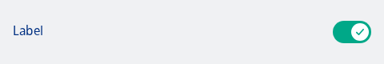
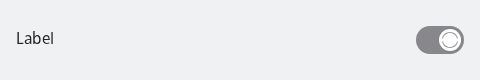

#### Toggle Row simple example with only 2 states



```kotlin
var checked by remember { mutableStateOf(true) }
NesToggleRow(
    label = "Label",
    checked = checked,
    onCheckedChange = { checked = it }
)
```

#### Toggle row in loading state



```kotlin
var checked by remember { mutableStateOf(false) }
NesToggleRow(
    label = "Label",
    state = NesToggleableState.Loading,
    onCheckedChange = { checked = it }
)

// Helper to get the checked boolean based on NesToggleableState
val isOn = NesToggleableState(checked)
```

#### Only toggle based on Boolean


```kotlin
var checked by remember { mutableStateOf(true) }
NesToggle(
    checked = checked,
    onCheckedChange = { checked = it }
)
```

