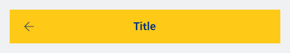
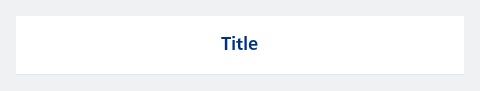
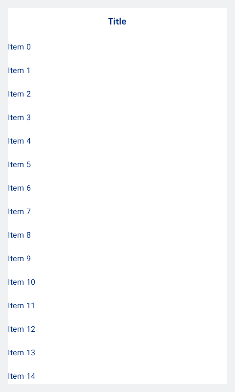

#### Title and back navigation



```kotlin
NesTextTopAppBar(
    title = "Title",
    showBackNavigationIcon = true,
)
```

#### Modal style and force show divider



```kotlin
NesTextTopAppBar(
    style = NesTopAppBarStyle.Modal,
    title = "Title",
    showDivider = true
)
```

#### Modal style and show divider when scrolled

If the divider needs to be only showing when the content is scrolled.



```kotlin
val state = rememberLazyListState()
val isScrolled by remember {
    derivedStateOf {
        state.firstVisibleItemIndex > 0 || state.firstVisibleItemScrollOffset > 0
    }
}

NesScaffold(
    topBar = {
        NesTextTopAppBar(
            style = NesTopAppBarStyle.Modal,
            title = "Title",
            showDivider = isScrolled
        )
    },
    content = { paddingValues ->
        LazyColumn(
            modifier = Modifier.padding(paddingValues),
            state = state // make sure to use the same state
        ) {
            items(25) {
                NesText(
                    text = "Item $it",
                    modifier = Modifier.minimumInteractiveComponentSize().fillMaxWidth()
                )
            }
        }
    },
    backgroundColor = NesTokens.colors.contentBackgroundDefault
)
```

