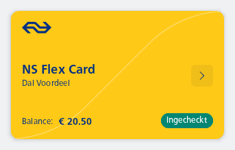
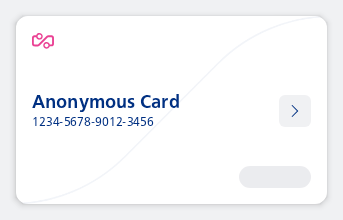
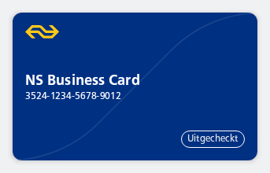

#### Filled in Travel Card

Show an active & checked-in travel card with NS Flex styling and a balance of 20.50 euro.



```kotlin
NesTravelCard(
    name = "NS Flex Card",
    subtext = NesState.Success("Dal Voordeel"),
    checkInLabel = NesState.Success("Ingecheckt"),
    balanceInCents = NesState.Success(2050),
    type = NesTravelCardType.NSFlex,
    onClick = { println("Card clicked") }
)
```

#### Showing a loading state

Show an Anonymous styled travel card where the check-in state is still loading.



```kotlin
NesTravelCard(
    name = "Anonymous Card",
    subtext = NesState.Success("1234-5678-9012-3456"),
    checkInLabel = NesState.Loading,
    type = NesTravelCardType.Anonymous,
    onClick = { println("Card clicked") }
)
```

#### Travel Card with balance and always showing decimals

Show an active & checked-in travel card with NS Flex styling with a balance of exactly 10 euro. The balance should always be shown with decimals. (e.g. 10.00 or 10,00 depending on locale)


```kotlin
NesTravelCard(
    name = "NS Flex Card",
    subtext = NesState.Success("Dal Voordeel"),
    checkInLabel = NesState.Success("Ingecheckt"),
    balanceInCents = NesState.Success(1000),
    balanceAlwaysShowDecimals = true,
    type = NesTravelCardType.NSFlex,
    onClick = { println("Card clicked") }
)
```

#### Non-interactable Travel Card

Show an active & checked-out travel card with NS Business styling and no balance.



```kotlin
NesTravelCard(
    name = "NS Business Card",
    subtext = NesState.Success("3524-1234-5678-9012"),
    checkInLabel = NesState.Success("Uitgecheckt"),
    checkedIn = false,
    balanceInCents = NesState.None,
    type = NesTravelCardType.NSBusiness,
)
```

