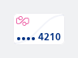

#### Anonymous with card number



```kotlin
NesTravelCardInline(
    type = NesTravelCardInlineType.Anonymous,
    size = NesTravelCardInlineSize.Default,
    cardNumber = NesState.Success("4210")
)
```

#### Business without card number


```kotlin
NesTravelCardInline(
    type = NesTravelCardInlineType.NSBusiness,
    size = NesTravelCardInlineSize.Default,
    cardNumber = NesState.None
)
```

#### Compact single ticket


```kotlin
NesTravelCardInline(
    type = NesTravelCardInlineType.SingleTicket,
    size = NesTravelCardInlineSize.Compact,
)
```

